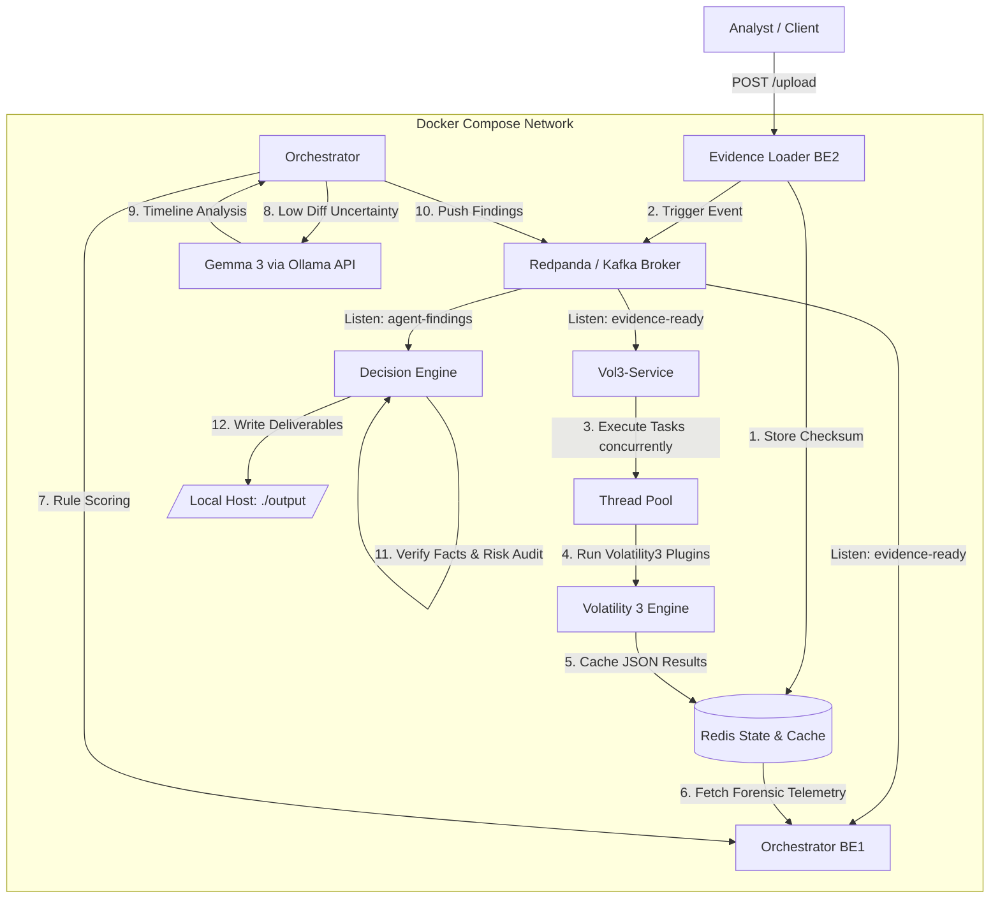

# project-iron-hand
Project Iron Hand is an AI-powered, distributed cyber incident investigation platform designed to automate digital forensics and incident response (DFIR) workflows. The system ingests low-level operating system artifacts and forensic data, automatically validates evidence integrity, orchestrates concurrent analytical pipelines, and leverages local large language models to generate structured security assessments.
The primary goal of Project Iron Hand is to significantly reduce incident response times by automating manual forensic routines and providing highly reliable, human-readable investigation narratives.
## Problem
Modern digital forensics investigations produce overwhelming volumes of telemetry from memory dumps, kernel logs, and system events. Security analysts often lose critical hours during time-sensitive incidents because they have to manually review raw dumps, validate investigative hypotheses across scattered tools, cross-reference contradictory findings, and compile formal investigation reports.

Project Iron Hand automates these stages by consolidating industry-standard forensic engines (Volatility 3) and advanced machine learning models into an autonomous, event-driven pipeline.
## Architecture & Core Modules
The platform is engineered as a decoupled microservices architecture. All components remain completely isolated and communicate asynchronously using a high-performance message broker (Redpanda) and a shared state store (Redis).
### System Architecture Diagram


# Evidence Loader (BE2)
The ingestion gateway of the platform, responsible for secure artifact reception, metadata extraction, and initial pipeline triggering.
- Responsibilities:
Multipart Stream Processing: Accepts heavy forensic artifacts (memory dumps and log packages) via a managed HTTP API with built-in size restrictions (up to 20 GB).

Artifact Type Detection: Automatically fingerprints incoming evidence by tracking file signatures, magic bytes, and entropy metrics (allowing the identification of raw dumps missing standard headers).

Integrity & Chain of Custody Control: Computes cryptographic SHA-256 checksums to guarantee evidence non-repudiation and performs immediate validation of Linux images via kernel banner scanning.

State Initialization: Registers new cases within the global state repository and publishes the initial activation token to the messaging bus.
# Vol3-Service
A high-performance forensic processing worker designed to bridge raw binary data streams with structured analytical backend engines.

Responsibilities:
Thread Pool Concurrency Management: Controls a multi-threaded task queue executor, spinning up parallel low-level analysis tasks without blocking system resources.

Volatility 3 Automation: Programmatically orchestrates and parses execution data from core Linux memory analysis plugins:
linux.pslist / linux.cmdline – Extracts active process trees and execution arguments.

linux.bash – Recovers shell execution history directly from volatile memory.

linux.netstat – Maps active, dormant, and hidden network sockets.

linux.lsmod – Scans loaded kernel modules to detect hidden rootkits.

linux.malfind – Pinpoints code injections in unbacked memory regions.

Result Caching: serializes and stores structured JSON plugin outputs into Redis with unique, case-specific keys to eliminate redundant execution overhead.

# Orchestrator (BE1)
The centralized analytical engine of the platform, managing investigation logic, telemetry correlation, and algorithmic confidence scoring.

Responsibilities:
Hypothesis Tracker: Aggregates findings from various forensic layers and computes live confidence levels for distinct threat vectors, such as Rootkit installation or Lateral Movement.

Concurrency Protection: Implements distributed locking patterns via Redis (SETNX) to ensure single-worker case processing and eliminate race conditions.

Uncertainty Resolution (Self-Correction): Monitors the telemetry output delta. If the metric gap between competing top hypotheses falls below a critical threshold (diff < 0.1), it automatically triggers an extended validation subroutine.

Local LLM Integration: Formulates context-aware evaluation prompts and pushes raw, chronological syslog streams to a local Gemma 3 model using the Ollama API, bypassing rigid rules for deep anomaly resolution.

# Decision Engine
The final verification and reporting node within the pipeline, acting as the quality control layer of the investigation.

Responsibilities:
Risk Assessment & Classification: Evaluates adjusted confidence margins and maps processed cases into clear priority bands (LOW, MEDIUM, HIGH).

Hallucination & Bias Mitigation: Audits AI-generated suggestions against validated facts cached in Redis, applying penalization weights to the score if conflicting claims are detected.

Dead-Letter Queue (DLQ) Management: Safely routes malformed messages or unverified pipeline states into an isolated topic (dead-letter-topic) for manual review.

Narrative Generation: Compiles verified facts and analytical traces into a comprehensive, markdown-formatted formal incident report (ir_report.md).

Data Flow
[Forensic artifacts] ➔ Ingestion (Evidence Loader) ➔ SHA-256 & State Init
                              │
                    (Topic: evidence-ready)
                              ▼
                   Processing (Vol3-Service) ➔ Multi-threaded Volatility 3
                              │
                     (Cached in Redis Store)
                              ▼
                  Correlation (Orchestrator) ➔ Hypothesis Scoring & Gemma 3 Analysis
                              │
                    (Topic: agent-findings)
                              ▼
                   Reporting (Decision Engine) ➔ Hallucination Audit ➔ Markdown Report

## Technology Stack
- Core Backend: Go (Golang) – Chosen for native concurrency, fast compilation, and low memory consumption across active microservices.
- Message Broker: Redpanda – A high-throughput, Kafka-compatible event streaming platform.
- State & Cache Store: Redis – Handles ultra-fast result caching, state distribution, and atomic locks.
- AI Orchestration: Ollama / Gemma 3 – Powers local, air-gapped LLM agents to process sensitive forensic logs without external privacy leaks.
- Forensics Core: Python 3 / Volatility 3 – Executes deep, low-level binary analysis of OS memory dumps.
- Infrastructure: Docker / Docker Compose – Guarantees completely reproducible environments across deployment targets.
## Installation

For system lauching I'm using Docker Compose. Make sure you downloaded both Docker and Docker Compose.
1. Clone repository
```bash
git clone https://github.com/geniuspc/ai-analyst.git
cd ai-analyst
```
2. Create the necessary local folders for data:
```bash
mkdir -p evidence_data output
```
3. Launch it
```bash
docker-compose up --build
```
Access to services after launch
Evidence Loader (API): http://localhost:8080/upload — upload point for memory dumps (.raw, .lime, .bin) and logs.

Analysis results: Final incident reports in Markdown format will be automatically saved on your computer in the local folder ./output/<case_id>/ir_report.md.
## Architecture Overview
The project is built on a microservices architecture and follows an Event-Driven approach. All components communicate through a data bus and cache, remaining independent from one another:
**Evidence Loader (BE2):** The system's entry point. It receives files via API, validates them (entropy checks, signatures, Linux banners), stores them on disk, and publishes an event to Redpanda.

**Redpanda (Kafka):** Our message broker. It distributes tasks across the entire processing pipeline.

**Vol3-Service:** A high-performance worker. It listens for memory dump readiness events and launches parallel analysis through an internal thread pool, using plugins such as `linux.pslist`, `linux.bash`, `linux.netstat`, and others.

**Orchestrator (BE1):** The core of the platform. It gathers data from the cache, calculates hypothesis scores (e.g., Rootkit, Lateral Movement), and, when rule-based logic reaches a dead end, invokes Gemma 3 through the Ollama API for deeper anomaly analysis.

**Decision Engine:** The final node in the pipeline. It evaluates the model's hallucination level, assigns a final risk assessment score, and generates a Markdown report.

**Redis:** Acts as a high-speed shared cache for plugins, stores intermediate states, and manages distributed case locking using `SETNX`.

## Supported artifacts
Currently, the system automatically detects and processes the following data types:
- Memory dumps (Linux): .raw, .mem, .lime, .bin formats (with mandatory validation via Volatility banners).
- System logs: Linux logs (auth.log, syslog, kern.log, audit.log), as well as the structured journald format in JSON.


## How it works (Data pipeline)
You submit an artifact via POST /upload to Evidence Loader.
The service validates the file, saves the checksum in Redis, and sends a message to the evidence-ready topic.
Vol3-Service picks up the task, runs six key Volatility 3 plugins in multiple threads, and saves the analysis results in Redis.
Orchestrator collects all logs, runs scoring, and if the difference between the top hypotheses is too small (diff < 0.1), sends the raw logs to Gemma 3 for self-correction analysis.
Decision Engine generates the final ir_report.md and saves it to the output/ folder.
## Environmental variables

If you need to run services locally (without Docker) or change ports, use the following variables:
REDIS_ADDR Redis connection address: localhost:6379
KAFKA_BROKERS Redpanda/Kafka broker address: localhost:9092

## Dataset & Test Artifacts Documentation

Since Project Iron Hand is an infrastructure-driven DFIR platform rather than a static model-training script, it does not include a built-in training dataset. Instead, the pipeline operates on raw forensic evidence images.

### Reference Test Samples
For validation and integration testing, you can utilize standard publicly available forensic corpora:
1. **Volatility 3 Linux Profiles & Samples:** Official [Volatility Foundation](https://github.com/volatilityfoundation/volatility3) test dumps.
2. **SANS DFIR Challenge Images:** Standard memory captures featuring realistic rootkit deployments and lateral movement traces.

### Simulated Attack Vectors (Artifact Scheme)
To test the rule-based scoring and Gemma 3 self-correction, input artifacts should ideally contain telemetry reflecting the following signatures:
**Rootkit Vector:** Unbacked memory pages (detected via `malfind`), hidden PIDs, or unlinked kernel modules (`lsmod` vs `sysfs` mismatch).
**Log Tampering Vector:** Missing syslog spans, clearing of `auth.log`, or presence of string indicators like `promiscuous mode`, `segfault`, or unauthorized `sudo` executions.


## Accuracy, Verification & Anti-Hallucination Report

Project Iron Hand implements a multi-layered verification pipeline to ensure the accuracy of generated forensic insights and mitigate the risk of Large Language Model (LLM) hallucinations.

### 1. Algorithmic Scoring vs. AI Inference
The system does not rely blindly on generative AI. Accuracy is achieved by cross-referencing deterministic low-level forensic evidence with heuristic models:
* **Deterministic Baseline:** Volatility 3 plugins provide non-negotiable binary ground truth from kernel memory structures (e.g., exact process trees, active network connections, loaded modules).
* **Heuristic Layer (Orchestrator BE1):** Computes rule-based confidence scores for predefined threat vectors (Rootkits, Lateral Movement).
* **Contextual AI Validation (Gemma 3):** Invoked exclusively during high-uncertainty scenarios where rule-based logic yields borderline confidence gaps ($\Delta \text{treshold} < 0.1$).

### 2. Built-in Verification Mechanisms
The **Decision Engine** performs an automated quality audit on every generated findings package before compiling the final deliverable:
* **Fact-Grounding Audit:** Matches every claims narrative generated by the AI against the raw JSON telemetry cached in the isolated Redis store.
* **Contradiction Filtering:** Employs semantic consistency routines to detect and penalize contradictory statements within the timeline analysis (e.g., if a process is flagged as malicious but its corresponding binary signature is verified as a signed system utility).
* **Hallucination Rate Metrics:** Computes a localized reliability index based on the density of unsupported assumptions. If the hallucination rate exceeds the acceptable threshold ($> 0.30$), the system applies a dynamic penalization factor (subtracting $0.15$ from the final confidence level) to avoid false-positive escalations.

### 3. Pipeline Reliability Safeguards (DLQ)
To guarantee architectural execution accuracy, any unparsed data blocks, malformed internal messages, or pipeline tasks failing state-validation checks in Redis are automatically intercepted and isolated within the **Dead-Letter Topic** bus for manual triage by senior forensic analysts.
